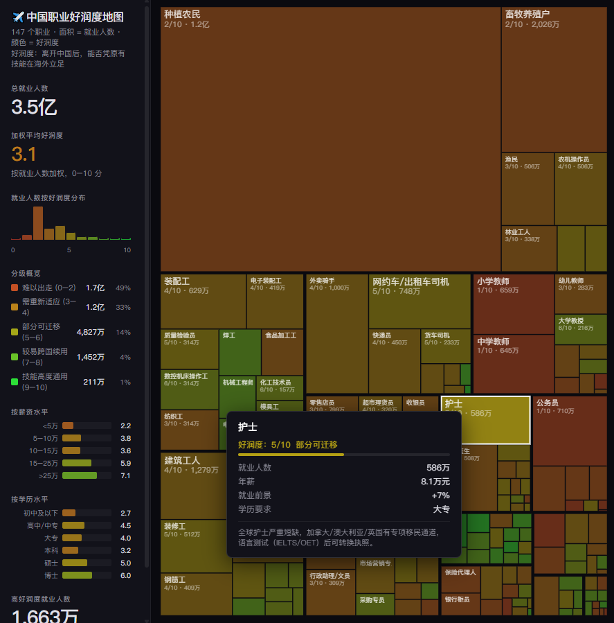

# 中国职业好润度地图

一个交互式网页，用 Treemap 可视化展示中国不同职业的“好润度”（跨国可迁移性）。

- 面积 = 就业人数
- 颜色 = 好润度（0-10，越绿越容易跨国续用）

---

## 在线体验

- 项目主页：`/`
- 好润度页面：`/run/`

如果你部署在 GitHub Pages，访问路径通常为：

- `https://<username>.github.io/<repo>/`
- `https://<username>.github.io/<repo>/run/`

---

## 页面预览
 


---

## 项目亮点

- **零构建依赖**：纯静态 HTML/CSS/JS，开箱即跑
- **高密度信息展示**：147 个职业同屏可比较
- **交互完整**：悬停提示、分级统计、薪资/学历分布
- **移动端优化**：手机端左侧统计栏可折叠

---

## 什么是“好润度”

“润”是中文互联网语境中“移民到国外”的表达。

本项目中的“好润度”指：离开中国后，是否能尽量不重学整套规则，继续依靠同类技能在海外就业。

评分考虑（包括但不限于）：

- 是否依赖本地客户与关系网络
- 是否依赖中文语言和本土文化语境
- 是否需要本地执照、执照转换难度如何
- 技术标准和工作流程是否全球通用

---

## 评分说明

- 分值范围：`0-10`
- 分值含义：分数越高，职业技能越容易跨国复用
- 数据性质：主观评分，仅供参考。

分级参考：

- `0-2`：难以出走
- `3-4`：需重新适应
- `5-6`：部分可迁移
- `7-8`：较易跨国续用
- `9-10`：技能高度通用

---

## 快速开始

本项目是纯静态站点，不需要安装依赖。

```bash
python -m http.server 8000
```

浏览器打开：

`http://localhost:8000`

---

## 目录结构

```text
.
├─ index.html          # 入口页（多页面导航）
├─ run/
│  ├─ index.html       # 好润度主页面
│  └─ data.json        # 147 职业评分数据
├─ cn/                 # 原中国 AI 冲击页面
├─ us/                 # 原美国 AI 冲击页面
├─ scripts/            # 数据构建脚本（历史/参考）
└─ data/               # 原始数据与中间数据
```

---

## 数据字段（`run/data.json`）

每条职业记录包含：

- `name`：职业名称
- `category`：职业类别
- `industry`：所属行业
- `employment`：就业人数（单位：万）
- `salary`：年薪（单位：万元）
- `education`：学历要求
- `growth`：就业增速
- `run_score`：好润度评分（0-10）
- `run_rationale`：评分理由

---

## 技术实现

- 原生 `HTML/CSS/JavaScript`
- `Canvas 2D` 绘制 treemap
- 自实现 `squarified treemap` 布局算法
- GitHub Pages 静态托管

---

## GitHub Pages 发布

1. 推送代码到 GitHub 仓库（主分支如 `main`）
2. 进入仓库 `Settings` -> `Pages`
3. `Source` 选择 `Deploy from a branch`
4. Branch 选 `main`，Folder 选 `/ (root)`，保存
5. 等待 1-3 分钟，访问：
   `https://<username>.github.io/<repo>/run/`

---

## 免责声明

本项目仅用于交流和可视化展示，不构成移民、就业或职业规划建议。评分为主观估计，可能与现实情况存在偏差。

## License

MIT
